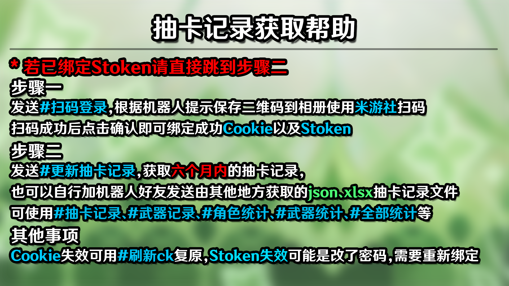

# Mamba-Plugin

## 项目介绍

覆盖或添加优化一些本体的功能说明(不是拓展插件的延续！)

**注意**:本插件一定要搭配`xiaoyao-cvs-plugin`使用！

我的原神星铁聊天群[285258025](http://qm.qq.com/cgi-bin/qm/qr?_wv=1027&k=9Fx5uUBjOPGuAvf-L-lXwkj4M9PAoytZ&authKey=nQ9xxvMPl1spFsQOrPfcl4aGJDASFGD5HRlgTXwsHIflNV8G6YXDeyIbLp%2FelueR&noverify=0&group_code=285258025)

## 安装方式

### 使用Git安装(根目录执行)

**Github**
```
git clone --depth=1 https://github.com/SmallK111407/mamba-plugin.git plugins/mamba-plugin/
```
**Gitee**
```
git clone --depth=1 https://gitee.com/SmallK111407/mamba-plugin.git plugins/mamba-plugin/
```

## 功能介绍

<details><summary>展开/收起</summary>

### 1.覆盖本体`#记录帮助`图片

覆盖的图片参考如下



### 2.国际服Cookie(Stoken)绑定教程

发送`#国际服ck帮助`或`#gck帮助`(这里g代表global)

### 3.待添加...

### 4.更新`曼巴插件`(仅主人)

发送`#曼巴更新`即可更新`曼巴插件`

</details>

## 免责声明

1. 功能仅限内部交流与小范围使用，请勿将本仓库用于以盈利为目的的场景
2. 图片与其他素材均来自于网络，仅供交流学习使用，如有侵权请联系，会立即删除

## 其他或致谢
* 本项目遵循[MIT](./LICENSE)开源协议
* [点击此处赞助我](../../../../SmallK111407/SponsorList)
* 感谢所有提交图片的贡献者
* 您的Star是我们更新的最大动力！
